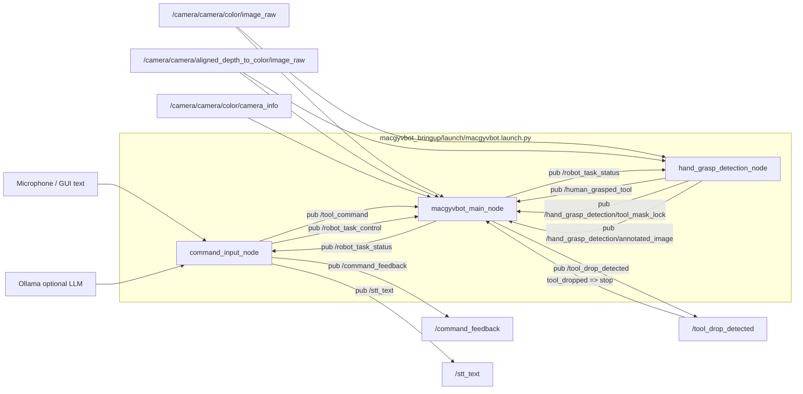

# MacGyvBot

MacGyvBot은 음성 명령으로 공구를 가져오고 반납하는 ROS 2 기반 로봇팔
어시스턴트입니다. RealSense 카메라, YOLO/VLM perception, MoveItPy 기반
Doosan M0609 제어, OnRobot RG2 그리퍼, hand-tool grasp detection, GUI/STT/TTS
명령 입력을 하나의 데모 파이프라인으로 묶습니다.

현재 저장소는 `src/` 아래의 다중 ROS 패키지 구조를 기준으로 실행합니다.
저장소 루트는 colcon workspace root이며, runtime 패키지는 `src/` 아래에
있습니다.

## 기본 동작

- 기본 grasp point mode는 `vlm`입니다.
- 기본 hand grasp mask lock은 `sam_enabled:=true`입니다.
- VLM/SAM/ML 모델 파일은 Git에 포함하지 않고 `macgyvbot_resources` 아래에 둡니다.
- VLM 추론이나 depth 보정이 실패하면 bbox center grasp point로 fallback합니다.
- API grasp point mode가 실패하면 기본 grasp point mode인 `vlm`으로 fallback하고,
  그마저 실패할 때만 bbox center로 fallback합니다.
- 사용자 handoff grasp는 ML grasp, depth contact, locked mask contact가 모두
  통과해야 인정합니다.

## 패키지 구조

```text
src/
├── macgyvbot_bringup/        # launch/config wiring
├── macgyvbot_task/           # main task node, pick/return workflow
├── macgyvbot_command/        # command input, parser, STT/TTS, GUI
├── macgyvbot_perception/     # YOLO, VLM, depth, hand grasp perception
├── macgyvbot_manipulation/   # MoveIt, gripper, force, pose, safe workspace
├── macgyvbot_config/         # shared Python runtime constants
├── macgyvbot_domain/         # shared dataclasses
├── macgyvbot_resources/      # calibration and model assets
├── macgyvbot_interfaces/     # shared msg/srv/action contracts
└── macgyvbot_ui/             # future independent UI boundary
```

주요 역할:

- `macgyvbot_bringup`: `macgyvbot.launch.py` 기본 실행 entrypoint
- `macgyvbot_task`: `macgyvbot` executable, task queue, pick/return orchestration
- `macgyvbot_perception`: object detection, grasp point selection, hand grasp detection
- `macgyvbot_manipulation`: robot motion/gripper/force sensing adapter
- `macgyvbot_command`: GUI, STT, TTS, command parser, `/tool_command`와 `/robot_task_control` 발행
- `macgyvbot_resources`: calibration, YOLO, VLM, SAM, `.pkl` 모델 설치 경로

## Pipeline



Pick flow 요약:

1. command node가 사용자의 `bring` 명령을 `/tool_command`로 발행합니다.
2. task node가 target tool을 찾고 YOLO bbox를 선택합니다.
3. 기본 `vlm` mode에서 VLM이 grasp point/yaw를 선택하고 depth로 base pose를 계산합니다.
4. MoveItPy로 접근, 하강, gripper close를 수행합니다.
5. gripper grasp 성공 후 `status=grasp_success`를 발행합니다.
6. hand grasp node가 최신 SAM mask 또는 bbox ROI를 lock하고 ack를 발행합니다.
7. task node는 mask lock ack 이후에만 lift/handoff 이동을 계속합니다.
8. 사용자가 공구를 잡으면 gripper를 열고 Home으로 복귀합니다.

Return flow 요약:

1. command node가 `return` 명령을 `/tool_command`로 발행합니다.
2. task node가 관찰 자세로 이동해 사용자가 들고 있는 공구/손 위치를 찾습니다.
3. 손/공구 위치로 이동해 gripper close 후 grasp 성공을 확인합니다.
4. Home joint pose로 이동하고 force feedback으로 Z 하강을 멈춘 뒤 공구를 놓습니다.
5. Home으로 복귀하고 완료 상태를 발행합니다.

Task queue / safety control:

- `bring`과 `return` workflow는 `TaskStep` queue에 적재되어 worker thread에서
  순차 실행됩니다.
- `/tool_command`는 새 pick/return 작업을 만들고, `/robot_task_control`은 실행 중인
  queue에 `stop`, `pause`, `resume` 제어를 적용합니다.
- `stop`은 현재 MoveIt trajectory goal을 cancel하고 대기 중인 step queue를
  비운 뒤 작업을 종료합니다.
- 최신 구현에서는 사용자 `exit` 요청이 `/robot_task_control`의 `exit` action으로
  전달되며, 실행 중인 MoveIt goal과 task queue를 종료한 뒤 Home joint pose로
  복귀하고 OnRobot RG2 그리퍼를 open합니다.
- `pause`는 현재 trajectory goal을 cancel하되 대기 중인 queue는 유지합니다.
  pause로 중단된 step은 재시도 가능한 경우 queue 앞에 다시 삽입됩니다.
- `/tool_drop_detected`의 `event=tool_dropped` payload는 자동 stop 신호로
  해석되어 queue clear와 MoveIt goal cancel을 수행합니다. 이 경우에는
  `/robot_task_status`의 `tool_dropped` 상태가 `cancelled`로 덮이지 않도록 처리합니다.
- 최신 구현에서는 `tool_dropped`도 내부적으로 `exit` 제어 흐름을 사용해 queue clear와
  MoveIt goal cancel을 수행합니다.

## 실행 환경

- OS: Ubuntu 22.04
- ROS 2: Humble
- Python: 3.10
- Robot: Doosan Robotics M0609
- Gripper: OnRobot RG2
- Camera: Intel RealSense D435I

Doosan ROS 2 설치는 [Doosan ROS 2 Manual(Humble)](https://doosanrobotics.github.io/doosan-robotics-ros-manual/humble/installation.html)을 따릅니다.

## 설치와 빌드

MacGyvBot은 홈 디렉터리 아래에 단독 colcon workspace로 clone해서 사용합니다.

```bash
cd ~
git clone https://github.com/MacGyvBot/macgyvbot.git
```

Python 의존성:

```bash
cd ~/macgyvbot
sudo apt update
sudo apt install portaudio19-dev python3-pyaudio ffmpeg
python3 -m pip install -r requirements.txt
```

`portaudio19-dev`는 pip가 `PyAudio`를 source build할 때 필요한
PortAudio header를 제공합니다. `python3-pyaudio`는 Ubuntu 패키지로
PyAudio를 함께 설치하며, `ffmpeg`는 `edge-tts` 음성 재생에 사용됩니다.

워크스페이스 빌드:

```bash
source /opt/ros/humble/setup.bash
cd ~/macgyvbot
colcon build
source ~/macgyvbot/install/setup.bash
```

브랜치나 모델 리소스를 바꾼 뒤에는 다시 빌드하고 새 터미널에서 source합니다.

```bash
source /opt/ros/humble/setup.bash
cd ~/macgyvbot
colcon build
source install/setup.bash
```

## 모델과 리소스 위치

모델 파일은 Git에 커밋하지 않습니다. 개발 중에는 아래 위치에 둡니다.

```text
src/macgyvbot_resources/calibration/T_gripper2camera.npy
src/macgyvbot_resources/weights/yolov11_best.pt
src/macgyvbot_resources/weights/hand_grasp_model.pkl
src/macgyvbot_resources/weights/mobile_sam.pt
src/macgyvbot_resources/weights/vlm/<model_dir>/
```

빌드 후에는 `macgyvbot_resources` package share 아래로 설치됩니다.

```text
install/macgyvbot_resources/share/macgyvbot_resources/calibration/
install/macgyvbot_resources/share/macgyvbot_resources/weights/
```

기본 launch는 `macgyvbot_resources`의 설치 경로를 사용합니다.
외부 파일을 쓰려면 launch argument로 절대경로를 넘깁니다.

```bash
ros2 launch macgyvbot_bringup macgyvbot.launch.py \
  yolo_model:=/path/to/yolov11_best.pt \
  grasp_model:=/path/to/hand_grasp_model.pkl \
  sam_checkpoint:=/path/to/mobile_sam.pt
```

SAM checkpoint 다운로드:

```bash
python src/macgyvbot_resources/weights/download_sam_weights.py --model mobile_sam
```

원본 SAM ViT-B checkpoint:

```bash
python src/macgyvbot_resources/weights/download_sam_weights.py --model sam_vit_b
```

VLM 가중치는 `src/macgyvbot_resources/weights/vlm/` 아래에 둡니다.
프로젝트의 다운로드 스크립트를 사용하는 경우:

```bash
python src/macgyvbot_resources/weights/download_vlm_weights.py
```

Qwen2.5-VL 3B/7B local weight를 받으려면:

```bash
python src/macgyvbot_resources/weights/download_Qwen_3b_weights.py
python src/macgyvbot_resources/weights/download_Qwen_7b_weights.py
```

### VLM Grasp Dataset Collection

Qwen fine-tuning용 grasp image dataset은 RealSense + YOLO collector로
수집합니다.

```bash
python src/macgyvbot_perception/data/collect_vlm_grasp_dataset.py
```

Preview window controls:

- `s`: current frame, annotated frame, YOLO detections, bbox crop, SAM overlay crop 저장
- `q`: 종료

Samples are written under:

```text
src/macgyvbot_perception/data/grasp_dataset/
```

Each sample contains `image_bgr.png`, `annotated.png`, `metadata.json`, and
YOLO bbox crops under `crops/`. When SAM is available, metadata also includes
the SAM overlay crop path used as the image-to-grasp-point VLM input. The
generated dataset directory is ignored by Git.

### Qwen Grasp Fine-Tuning

LoRA/QLoRA training code lives at:

```text
src/macgyvbot_perception/train/train_qwen_grasp_lora.py
```

The trainer uses the exact runtime prompt from `VLMOnlyGraspPointSelector` and
learns to output strict JSON with `x_px`, `y_px`, and `yaw_deg`.

Expected CSV columns:

```csv
image_path,x_px,y_px,yaw_deg,confidence,reason
session_.../sample/crops/00_tool_0.91_sam_crop.png,123,84,-12.5,1.0,teacher answer
```

Run:

```bash
python src/macgyvbot_perception/train/train_qwen_grasp_lora.py \
  --csv path/to/grasp_labels.csv
```

By default, fine-tuned LoRA adapter checkpoints are saved to:

```text
src/macgyvbot_resources/weights/vlm/Qwen_finetuning/
```

## 전체 파이프라인 실행

각 터미널은 새로 열 때마다 ROS와 MacGyvBot workspace를 source합니다.

```bash
source /opt/ros/humble/setup.bash
source ~/macgyvbot/install/setup.bash
```

### 1. Doosan M0609 + MoveIt

```bash
ros2 launch dsr_bringup2 dsr_bringup2_moveit.launch.py \
  mode:=real \
  model:=m0609 \
  host:=192.168.1.100
```

### 2. RealSense Camera

```bash
ros2 launch realsense2_camera rs_align_depth_launch.py \
  depth_module.depth_profile:=640x480x30 \
  rgb_camera.color_profile:=640x480x30 \
  initial_reset:=true \
  align_depth.enable:=true
```

### 3. MacGyvBot

기본 실행은 `grasp_point_mode:=vlm`, `sam_enabled:=true`입니다.

```bash
ros2 launch macgyvbot_bringup macgyvbot.launch.py
```

명시적으로 VLM mode:

```bash
ros2 launch macgyvbot_bringup macgyvbot.launch.py grasp_point_mode:=vlm
```

단일 호출 VLM-only mode는 사용할 모델을 명시해서 실행합니다:

```bash
ros2 launch macgyvbot_bringup macgyvbot.launch.py grasp_point_mode:=vlm_only_smol
ros2 launch macgyvbot_bringup macgyvbot.launch.py grasp_point_mode:=vlm_only_qwen3b
ros2 launch macgyvbot_bringup macgyvbot.launch.py grasp_point_mode:=vlm_only_qwen7b
```

VLM 없이 bbox center mode:

```bash
ros2 launch macgyvbot_bringup macgyvbot.launch.py grasp_point_mode:=center
```

Gemini API grasp point mode:

```bash
cp src/macgyvbot_resources/.env.example src/macgyvbot_resources/.env
nano src/macgyvbot_resources/.env
ros2 launch macgyvbot_bringup macgyvbot.launch.py \
  grasp_point_mode:=api \
  grasp_point_api_model:=gemini-2.5-flash
```

In `src/macgyvbot_resources/.env`, fill the template like this:

```text
GEMINI_API_KEY=your_real_key_here
```

`src/macgyvbot_resources/.env` is ignored by Git. The repository tracks only
`src/macgyvbot_resources/.env.example` as the empty template.

API mode 주의사항:

- Gemini API grasp point mode는 네트워크 상태, API quota, 모델 응답 형식에 따라
  local VLM mode보다 성능과 안정성이 떨어질 수 있습니다.
- 이미지와 프롬프트를 함께 보내기 때문에 입력 토큰 여유가 크지 않습니다. 긴
  task text나 과도한 프롬프트를 넣으면 응답 실패나 품질 저하가 생길 수 있습니다.
- 반복 실행 시 토큰/quota가 빠르게 소진될 수 있습니다. 실제 로봇 테스트에서는
  필요한 경우에만 `grasp_point_mode:=api`를 사용하고, 기본값인 `vlm` mode를
  우선 사용합니다.
- API 호출 실패 시에는 자동으로 기본 grasp point mode인 `vlm`으로 fallback합니다.

SAM을 끄고 bbox lock fallback만 사용:

```bash
ros2 launch macgyvbot_bringup macgyvbot.launch.py sam_enabled:=false
```

마이크 STT 없이 GUI 키보드 입력만 사용:

```bash
ros2 launch macgyvbot_bringup macgyvbot.launch.py use_stt:=false
```

TTS를 끄고 실행:

```bash
ros2 launch macgyvbot_bringup macgyvbot.launch.py use_tts:=false
```

## 명령 입력

전체 launch는 command GUI/STT/TTS 노드를 함께 실행합니다. 사용자는 GUI 또는
마이크로 아래와 같은 명령을 줄 수 있습니다.

GUI는 위쪽에 왼쪽 로봇 상태, 가운데 detector 화면, 오른쪽 채팅창을 두고,
로봇 상태와 detector 화면 아래쪽에는 넓은 Task Log를 배치합니다.
Detector 화면은 `/hand_grasp_detection/annotated_image`를 구독해 GUI 안에만
표시합니다. Perception 노드는 `publish_annotated:=true`, `display:=false`로
실행되고 main task node의 `display_debug_windows` 기본값도 `false`이므로
별도 OpenCV detector/debug 창은 띄우지 않습니다.

```text
드라이버 가져다줘
플라이어 가져와
망치 줘
아까 가져온 거 정리해
지금 뭐 하는 중이야?
멈춰
재개
종료
```

GUI는 로봇 작업 상태를 채팅, 상태 패널, Task Log로 나누어 표시합니다.
진행 중인 탐색/이동/파지 단계는 Task Log에 `HH:MM:SS [INFO] ...`
형식으로 남고, 사용자 행동이 필요한 상태나 완료/실패 상태만 MacGyvBot
말풍선과 TTS로 안내합니다. `정지`, `재개`, `종료`도 LLM/parser action으로
분류합니다.

제어 action은 아래 이름을 사용합니다.

- `pause`: 사용자가 “멈춰”, “정지”, “중단”, “스탑”처럼 말했을 때 발행되는 일시정지/정지 요청
- `resume`: 사용자가 “재개”, “다시 시작”, “계속해”처럼 말했을 때 해석되는 재개 요청
- `exit`: 사용자가 “종료”, “끝내”, “꺼줘”처럼 말했을 때 해석되는 종료 요청

`pause`와 `resume`은 `/robot_task_control`로 전달됩니다. `pause`가 들어오면
command GUI는 정지 요청을 로봇 노드로 전달한 뒤 “작업을 재개할까요, 아니면
종료할까요?”라고 묻고 `재개` / `종료` quick reply 버튼을 표시합니다.
`재개`는 `/robot_task_control`의 `resume` 요청으로 발행하고, `종료`는
command GUI 종료 요청으로 해석해 로봇 task 제어 topic에는 발행하지 않습니다.
최신 구현에서는 `종료`도 `/robot_task_control`의 `exit` 요청으로 발행하며,
로봇은 현재 작업을 중단한 뒤 Home joint pose로 복귀하고 그리퍼를 엽니다.

VLM grasp point 선택 과정에서 모델 가중치 로딩, 로딩 완료, CPU 실행 경고,
로드 실패 같은 상태는 `/robot_task_status`를 통해 GUI에 전달됩니다. 이 상태는
Task Log와 MacGyvBot 채팅 말풍선으로 표시하지만, 로딩 로그가 데모 중 과하게
들리지 않도록 TTS 대상에서는 제외합니다.

명령 해석 모드:

- `parser_mode:=llm_primary`: 기본값. LLM을 먼저 사용하고 실패하면 local parser fallback
- `parser_mode:=hybrid`: local parser를 먼저 사용하고 실패하면 LLM fallback

LLM fallback을 쓰려면 Ollama 서버와 모델이 필요합니다.

```bash
ollama pull gemma3:1b
ollama serve
```

GUI/명령 노드만 단독 실행:

```bash
ros2 run macgyvbot_command command_input_node
```

마이크 STT 단독 확인:

```bash
ros2 run macgyvbot_command command_input_node --ros-args \
  -p enable_microphone:=true
```

## 주요 Launch Arguments

| Argument | Default | 설명 |
| --- | --- | --- |
| `grasp_point_mode` | `vlm` | `vlm`, `vlm_only_smol`, `vlm_only_qwen3b`, `vlm_only_qwen7b`, `vlm_only`, `center`, or `api` |
| `grasp_point_api_model` | `gemini-2.5-flash` | Gemini API mode model name |
| `grasp_point_api_env_file` | `macgyvbot_resources/.env` | Local Gemini `.env` file |
| `grasp_point_api_base_url` | Gemini API default | Override Gemini API base URL |
| `grasp_point_api_timeout_sec` | `30.0` | API request timeout |
| `sam_enabled` | `true` | SAM mask tracking/lock 사용 여부 |
| `yolo_model` | `macgyvbot_resources/weights/yolov11_best.pt` | YOLO 모델 경로 |
| `grasp_model` | `macgyvbot_resources/weights/hand_grasp_model.pkl` | ML hand grasp classifier |
| `sam_checkpoint` | `macgyvbot_resources/weights/mobile_sam.pt` | MobileSAM checkpoint |
| `use_voice_command` | `true` | command input node 실행 여부 |
| `use_stt` | `true` | 마이크 STT 사용 여부 |
| `use_tts` | `true` | TTS 사용 여부 |
| `parser_mode` | `llm_primary` | `llm_primary` 또는 `hybrid` |
| `llm_model` | `gemma3:1b` | Ollama 모델명 |
| `force_torque_topic` | `/force_torque_sensor_broadcaster/wrench` | return Z 하강 force 입력 |
| `detector_image_topic` | `/hand_grasp_detection/annotated_image` | GUI 중앙 detector 화면 입력 |

## 주요 Topics

| Topic | Direction | Type | 설명 |
| --- | --- | --- | --- |
| `/tool_command` | command -> task | `std_msgs/String` JSON | bring/return/release 명령 |
| `/robot_task_control` | command -> task | `std_msgs/String` JSON | stop/pause/resume 작업 제어 |
| `/robot_task_status` | task -> command/perception | `std_msgs/String` JSON | 작업 상태, GUI/TTS, mask lock trigger |
| `/tool_drop_detected` | task monitor -> task/control/UI | `std_msgs/String` JSON | grasp 성공 후 의도치 않은 공구 drop 감지 이벤트, `tool_dropped`는 stop으로 처리 |
| `/target_label` | manual -> task | `std_msgs/String` | 수동 pick target label |
| `/human_grasped_tool` | perception -> task | `std_msgs/String` JSON | 사용자 hand-tool grasp 결과 |
| `/hand_grasp_detection/annotated_image` | perception -> command GUI | `sensor_msgs/Image` | GUI 중앙 detector overlay |
| `/hand_grasp_detection/tool_mask_lock` | perception -> task | `std_msgs/String` JSON | grasp_success 이후 mask lock ack |
| `/command_feedback` | command -> GUI | `std_msgs/String` JSON | 명령 해석 결과 |
| `/stt_text` | command -> command | `std_msgs/String` | STT/GUI 입력 텍스트 |

수동 bring 요청:

```bash
ros2 topic pub --once /target_label std_msgs/msg/String "{data: screwdriver}"
```

수동 return 명령:

```bash
ros2 topic pub --once /tool_command std_msgs/msg/String \
  "{data: '{\"tool_name\":\"screwdriver\",\"action\":\"return\",\"raw_text\":\"드라이버 반납해\",\"match_method\":\"manual\",\"match_score\":1.0,\"confidence\":1.0,\"status\":\"accepted\"}'}"
```

수동 작업 제어:

```bash
ros2 topic pub --once /robot_task_control std_msgs/msg/String \
  "{data: '{\"action\":\"pause\",\"reason\":\"manual_pause\"}'}"

ros2 topic pub --once /robot_task_control std_msgs/msg/String \
  "{data: '{\"action\":\"resume\",\"reason\":\"manual_resume\"}'}"

ros2 topic pub --once /robot_task_control std_msgs/msg/String \
  "{data: '{\"action\":\"stop\",\"reason\":\"manual_stop\"}'}"

ros2 topic pub --once /robot_task_control std_msgs/msg/String \
  "{data: '{\"action\":\"exit\",\"reason\":\"manual_exit\"}'}"
```

상태 표시 테스트:

```bash
ros2 topic pub --once /robot_task_status std_msgs/msg/String \
  "{data: '{\"status\":\"waiting_handoff\",\"tool_name\":\"screwdriver\"}'}"

ros2 topic pub --once /robot_task_status std_msgs/msg/String \
  "{data: '{\"status\":\"failed\",\"tool_name\":\"screwdriver\",\"reason\":\"robot_grasp_failed\"}'}"

ros2 topic pub --once /robot_task_status std_msgs/msg/String \
  "{data: '{\"status\":\"vlm_loading\",\"tool_name\":\"unknown\",\"message\":\"VLM 가중치 로드 시작...\"}'}"
```

## Hand Grasp Detection

`hand_grasp_detection_node`는 전체 launch에서 함께 실행됩니다.

기본 입력:

- `/camera/camera/color/image_raw`
- `/camera/camera/aligned_depth_to_color/image_raw`

기본 출력:

- `/human_grasped_tool`
- `/hand_grasp_detection/annotated_image`
- `/hand_grasp_detection/tool_mask_lock`

동작 조건:

- `/robot_task_status`가 `accepted`, `searching`, `picking`, `grasping`인 동안
  YOLO tool ROI와 SAM mask를 갱신합니다.
- `grasp_success`를 받으면 직전 SAM mask 또는 bbox ROI를 lock합니다.
- task node는 `/hand_grasp_detection/tool_mask_lock` ack를 받은 뒤에만 lift/handoff를 계속합니다.
- handoff pose에서는 locked mask contact, depth contact, ML classifier grasp를 함께 봅니다.
- 기본 ML confidence 기준은 `0.85`입니다.

## Gripper Grasp Verification

로봇이 실제로 공구를 잡았는지는 OnRobot RG 상태의 `grip detected`와 gripper
폭을 함께 확인합니다. gripper가 거의 완전히 닫힌 상태면 `grip detected`가
켜져도 실패로 처리합니다. 성공 신호가 안정적으로 유지될 때만
`status=grasp_success`를 발행합니다.

grasp 실패 시에는 최대 `GRASP_RETRY_LIMIT`회까지 open/close를 재시도합니다.
pick 실패는 `reason=robot_grasp_failed`, return 실패는
`reason=return_grasp_failed`로 상태가 발행됩니다.

## Return Flow

`return` 명령을 받으면 task node는 사용자가 들고 있는 공구/손 위치를 관찰한 뒤
그 위치로 이동해 공구를 받습니다. 이후 Home joint pose로 이동하고, force
feedback으로 Z 하강 중 접촉을 감지하면 하강을 멈춘 뒤 그리퍼를 열고 Home으로
복귀합니다.

반납 Z 하강 force 입력 topic은 launch argument `force_torque_topic`으로 바꿀 수
있습니다.

## TTS

기본값은 TTS 사용입니다. `edge-tts`가 설치되어 있으면 우선 사용하고, 없으면
`espeak-ng`를 fallback으로 사용합니다.

```bash
python3 -m pip install edge-tts
sudo apt install ffmpeg espeak-ng
```

주요 TTS arguments:

- `tts_engine`: `auto`, `edge`, `espeak-ng`
- `tts_voice`: 기본 `ko-KR-SunHiNeural`
- `tts_edge_rate`: 기본 `+25%`
- `tts_pitch`: 기본 `+35Hz`
- `tts_timeout_sec`: 기본 `20.0`

## 수동 초기화 명령어

로봇 실행 전 또는 테스트 중 초기 상태를 다시 맞추고 싶을 때 아래 명령어를 사용합니다.

이 명령은 M0609 로봇팔을 Home joint pose로 이동시킨 뒤, OnRobot RG2 그리퍼를 open합니다.

```bash
source /opt/ros/humble/setup.bash && source ~/macgyvbot/install/setup.bash && ros2 action send_goal /dsr_moveit_controller/follow_joint_trajectory control_msgs/action/FollowJointTrajectory "{trajectory: {joint_names: [joint_1, joint_2, joint_3, joint_4, joint_5, joint_6], points: [{positions: [0.0, 0.0, 1.57079632679, 0.0, 1.57079632679, 1.57079632679], time_from_start: {sec: 4}}]}}" && sleep 1 && python3 -c 'from macgyvbot_manipulation.onrobot_gripper import RG; g=RG("rg2","192.168.1.1",502); g.open_gripper(); g.close_connection()'
```

## 테스트

전체 패키지 테스트:

```bash
colcon test
colcon test-result --verbose
```

빠른 Python 문법 검사:

```bash
python3 -m compileall -q src
```

핵심 단위 테스트:

```bash
python3 -m pytest -q \
  src/macgyvbot_manipulation/test/test_handover_targeting.py \
  src/macgyvbot_manipulation/test/test_gripper_grasp.py \
  src/macgyvbot_perception/test/test_hand_grasp_ml_mask.py \
  src/macgyvbot_task/test/test_hand_grasp_result_adapter.py
```

ROS 2, MoveIt, 카메라, 실제 로봇 하드웨어가 필요한 검증은 장비 연결 환경에서
낮은 속도와 충분한 작업 공간을 확보한 뒤 수행합니다.

## 기여

브랜치, 커밋, PR, 이슈, 안전 규칙은 [CONTRIBUTING.md](./CONTRIBUTING.md)를
따릅니다. 런타임 구조나 config 구조를 바꾸면 `README.md`, `EXPLAIN.md`,
관련 package README를 함께 갱신합니다.

## YOLO 실험 커맨드

주의: 이 스크립트는 RealSense 카메라를 직접 엽니다. `ros2 launch realsense2_camera ...` 등으로
카메라 모듈을 이미 사용 중이라면 해당 ROS 2 카메라 노드를 종료한 뒤 실행합니다.

Preview 창 없이 로그만 확인하려면:

```bash
python src/macgyvbot_resources/weights/test_yolo_realsense.py --no-display
```

다른 모델 파일을 지정하려면:

```bash
python src/macgyvbot_resources/weights/test_yolo_realsense.py \
  --model src/macgyvbot_resources/weights/yolov11_best.pt \
  --conf 0.25 \
  --imgsz 640
```
