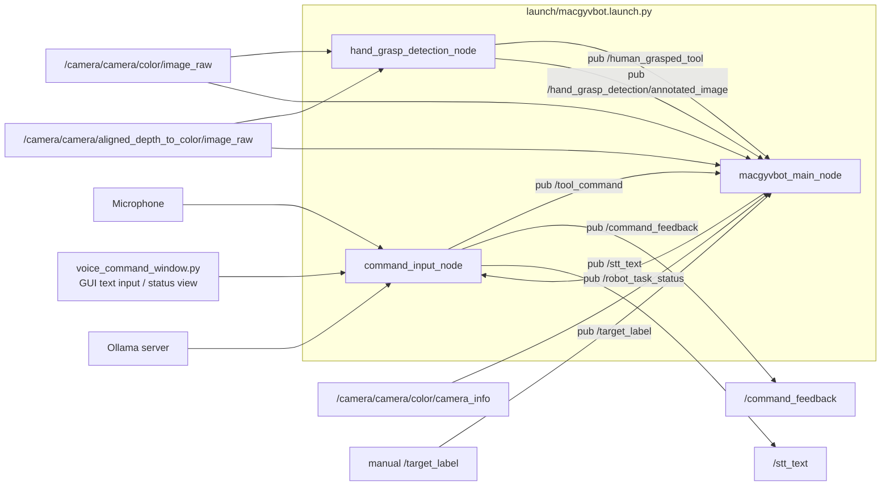

# MacGyvBot

MacGyvBot은 음성 명령 기반 공구 서랍 관리 로봇팔 어시스턴트를 위한 ROS 2 패키지입니다.

현재 저장소는 RealSense 카메라, YOLO 객체 인식, MoveItPy 기반 로봇팔 이동, OnRobot RG2 그리퍼 제어를 함께 다룹니다. 또한 사람이 로봇이 들고 있는 공구를 잡았는지 판단하는 hand-tool grasp detection 노드를 포함합니다.

## 패키지 구조

메인 pick 파이프라인은 ROS wiring과 기능별 책임을 분리해 구성합니다.

```text
macgyvbot/
├── nodes/
│   ├── macgyvbot_main_node.py           # ROS wiring, parameter, frame loop
│   ├── hand_grasp_detection_node.py     # hand grasp detection ROS wiring
│   └── command_input_node.py            # STT + GUI + 명령 해석 통합 노드
├── config/
│   └── config.py                        # topic, frame, safety offset, grasp mode
├── util/
│   ├── model_control/
│   │   ├── moveit_controller.py         # MoveIt planning 실행 및 J6 yaw 회전
│   │   ├── robot_pose.py                # pose 생성, EE transform/orientation helper
│   │   ├── onrobot_gripper.py           # OnRobot RG gripper 연결 및 제어
│   │   └── robot_safezone.py            # robot workspace safe zone clamp
│   ├── perception/
│   │   └── yolo_detector.py             # YOLO 모델 경로 해석 및 추론 wrapper
│   ├── hand_grasp/
│   │   ├── hand_detector.py             # MediaPipe hand landmark 검출
│   │   ├── tool_detector.py             # hand grasp용 YOLO tool ROI 검출
│   │   ├── grasp_detector.py            # hand-tool grasp 상태 판정
│   │   ├── calculations.py              # geometry/depth helper
│   │   └── visualization.py             # hand grasp overlay drawing
│   ├── grasp_mechanism/
│   │   └── grasp_by_vlm.py              # VLM 기반 grasp point 선택
│   ├── input_mapping/
│   │   └── command_hard_parser.py       # LLM fallback 전 alias/fuzzy parser
│   └── task_pipeline/
│       └── task_pipeline.py             # pick, handoff, 원위치 반환 시퀀스
├── ui/
│   └── voice_command_window.py          # PyQt command input window
```

기존 executable 이름은 `macgyvbot`으로 유지되며, entrypoint는 `nodes/macgyvbot_main_node.py`를 직접 사용합니다.

## Pipeline Structure

현재 launch 기준 실행 구조와 ROS topic pub/sub 관계는 아래와 같습니다.



각 노드 내부에서 어떤 파일이 어떤 역할을 맡는지도 함께 보면 아래와 같습니다.

```mermaid
flowchart TD
    subgraph command["command_input_node"]
        cmdnode["nodes/command_input_node.py\nGUI + STT + topic wiring"]
        ui["ui/voice_command_window.py\nPyQt GUI"]
        sttmod["util/command_input/stt/speech_to_text.py\nmicrophone STT wrapper"]
        parser["util/command_input/input_mapping/command_llm_parser.py\nlocal parser + LLM fallback"]
        hard["util/command_input/input_mapping/command_hard_parser.py\nalias / fuzzy command parsing"]
        ui --> cmdnode
        sttmod --> cmdnode
        parser --> cmdnode
        hard --> parser
    end

    subgraph handgrasp["hand_grasp_detection_node"]
        hgNode["nodes/hand_grasp_detection_node.py\ncamera subscriptions + result publishing"]
        handDet["hand_grasp/hand_detector.py\nMediaPipe hand landmarks"]
        toolDet["hand_grasp/tool_detector.py\nYOLO tool ROI detection"]
        calc["hand_grasp/calculations.py\ngeometry / depth / hand selection helpers"]
        graspDet["hand_grasp/grasp_detector.py\nhand-tool grasp state scoring"]
        viz["hand_grasp/visualization.py\noverlay rendering"]
        handDet --> hgNode
        toolDet --> hgNode
        calc --> hgNode
        calc --> handDet
        calc --> graspDet
        calc --> viz
        graspDet --> hgNode
        viz --> hgNode
    end

    subgraph mainbot["macgyvbot_main_node"]
        mainNode["nodes/macgyvbot_main_node.py\nmain ROS wiring + frame loop + command handling"]
        yolo["util/macgyvbot_main/perception/yolo_detector.py\nobject detection"]
        graspSel["util/macgyvbot_main/grasp_mechanism/grasp_point_selector.py\ncenter/VLM grasp-point routing"]
        vlm["util/macgyvbot_main/grasp_mechanism/grasp_by_vlm.py\nVLM grasp pixel inference"]
        depthProj["util/macgyvbot_main/perception/depth_projection.py\npixel+depth to base pose"]
        motion["util/macgyvbot_main/model_control/moveit_controller.py\nMoveIt planning / execution"]
        pose["util/macgyvbot_main/model_control/robot_pose.py\npose/orientation helpers"]
        safe["util/macgyvbot_main/model_control/robot_safezone.py\nworkspace clamp"]
        grip["util/macgyvbot_main/model_control/onrobot_gripper.py\nRG gripper control"]
        pipeline["util/macgyvbot_main/task_pipeline/task_pipeline.py\npick / handoff / return sequence"]
        yolo --> mainNode
        graspSel --> mainNode
        depthProj --> mainNode
        motion --> mainNode
        grip --> mainNode
        pipeline --> mainNode
        vlm --> graspSel
        pose --> depthProj
        pose --> motion
        pose --> pipeline
        safe --> motion
        safe --> pipeline
    end
```



토픽 기준으로 요약하면:

- `command_input_node`는 사용자 입력을 받아 `/tool_command`, `/command_feedback`, `/stt_text`를 발행하고 `/robot_task_status`를 구독합니다.
- `hand_grasp_detection_node`는 카메라 입력을 받아 `/human_grasped_tool`, `/hand_grasp_detection/annotated_image`를 발행합니다.
- `macgyvbot_main_node`는 카메라/명령/hand grasp 결과를 구독해서 pick pipeline을 실행하고 `/robot_task_status`를 발행합니다.

## 주요 기능

- RealSense color/depth 이미지 구독
- YOLO 기반 공구 및 대상 객체 인식
- hand landmark와 tool ROI 기반 잡기 상태 판단
- depth 기반 손-공구 접촉 신호 기본 사용
- MoveItPy 기반 Doosan M0609 경로 계획 및 실행
- OnRobot RG2 그리퍼 open/close 제어
- 안전 작업 영역 클램프 기반 pick sequence 제한

## 실행 환경

- OS: `Ubuntu 22.04`
- ROS 2: `Humble`
- Python: `3.10`
- 로봇팔: `Doosan-Robotics-M0609`
- 그리퍼: `OnRobot RG2`
- 카메라: `Intel RealSense Depth Camera D435I`

## 설치 및 빌드

[Doosan ROS 2 Manual(Humble)](https://doosanrobotics.github.io/doosan-robotics-ros-manual/humble/installation.html)

MacGyvBot은 두산로보틱스 ROS 2 패키지와 함께 사용합니다. `macgyvbot` 패키지는 두산로보틱스 워크스페이스의 `doosan-robot2` 아래에 clone한 뒤, `ros2_ws/src` 기준에서 빌드합니다.

```bash
cd ~/ros2_ws/src/doosan-robot2/
git clone https://github.com/MacGyvBot/macgyvbot.git
```

Python 패키지 설치:

```bash
pip install -r requirements.txt
```

전체 워크스페이스 빌드:

```bash
cd ~/ros2_ws
colcon build
```

`macgyvbot` 패키지만 빌드:

```bash
cd ~/ros2_ws
colcon build --packages-select macgyvbot
```

빌드 후 source:

```bash
source /opt/ros/humble/setup.bash
source ~/ros2_ws/install/setup.bash
```

## 전체 파이프라인 실행

각 터미널은 새로 열 때마다 ROS 2, `ros2_ws`, Doosan MoveIt 환경을 source한 뒤 실행합니다.

### Terminal 1: Doosan M0609 + MoveIt 실행

```bash
source /opt/ros/humble/setup.bash
source ~/ros2_ws/install/setup.bash

ros2 launch dsr_bringup2 dsr_bringup2_moveit.launch.py \
  mode:=real \
  model:=m0609 \
  host:=192.168.1.100
```

### Terminal 2: RealSense 카메라 실행

기본 실행은 YOLO bounding box 중심점을 grasp point로 사용합니다.

```bash
source /opt/ros/humble/setup.bash
source ~/ros2_ws/install/setup.bash

ros2 launch realsense2_camera rs_align_depth_launch.py \
  depth_module.depth_profile:=640x480x30 \
  rgb_camera.color_profile:=640x480x30 \
  initial_reset:=true \
  align_depth.enable:=true
```

### Terminal 3: MacGyvBot 메인 파이프라인 실행

기본 실행은 `center` grasp point mode를 사용합니다.

```bash
source /opt/ros/humble/setup.bash
source ~/ros2_ws/install/setup.bash

ros2 launch macgyvbot macgyvbot.launch.py
```

명시적으로 중심점 모드를 사용할 경우:

```bash
source /opt/ros/humble/setup.bash
source ~/ros2_ws/install/setup.bash

ros2 launch macgyvbot macgyvbot.launch.py grasp_point_mode:=center
```

VLM 기반 grasp point selection을 사용할 경우:

```bash
source /opt/ros/humble/setup.bash
source ~/ros2_ws/install/setup.bash

ros2 launch macgyvbot macgyvbot.launch.py grasp_point_mode:=vlm
```

VLM 모드는 YOLO가 검출한 객체 crop에서 grid 기반 grasp region을 선택한 뒤 depth로 grasp pixel을 보정합니다. VLM 추론 또는 depth 보정이 실패하면 기존 중심점 방식으로 fallback합니다.

VLA 기반 최종 grasp pose 보정을 사용할 경우:

```bash
source /opt/ros/humble/setup.bash
source ~/ros2_ws/install/setup.bash

ros2 launch macgyvbot macgyvbot.launch.py grasp_point_mode:=vla
```

VLA prompt update:
- The final grasp prompt now explicitly describes the robot as a two-finger parallel-jaw gripper.
- The requested action prioritizes placing the fingertip midpoint on the detected object center of mass/centroid.
- The prompt asks the wrist/gripper orientation to align with the object's main/principal axis and graspable cross-axis before closing.
- Object-specific cues are included from the detected label and bounding-box shape. Elongated tools are guided toward long-axis alignment, cylindrical/cup-like objects toward centered diameter grasps, rounded objects toward exact center pinches, and handle-like appendages are avoided unless they are the most stable centered grasp.
- The VLA is still expected to output one final 7-DoF action: `dx, dy, dz, droll, dpitch, dyaw, gripper`.

VLA 모드는 YOLO와 depth로 객체의 base 좌표를 구한 뒤, 기존 방식처럼 grasp 높이까지 먼저 접근합니다. 이후 바로 잡지 않고 z를 조금 다시 올린 switch pose에서 현재 카메라 영상과 end-effector 상태를 VLA에 넣어 최종 grasp pose를 보정합니다. VLA 가중치는 로컬 `weights/vla/<org>__<model>` 경로에서만 로드하며, 시작 시 로드에 실패하면 자동으로 `center` 모드로 fallback합니다. 추론이나 최종 pose 이동이 실패하는 경우에도 기존 grasp pose로 fallback합니다.

VLA 가중치 다운로드 예:

```bash
python3 weights/download_vla_weights.py
```

## 내부 구조

`grasp_point_mode`에 따라 grasp 단계가 다음처럼 달라집니다.

- `center`: YOLO bounding box 중심점을 grasp pixel로 사용하고 그대로 pick을 진행합니다.
- `vlm`: YOLO crop 이미지에서 VLM이 grasp region을 고르고, depth 보정을 거쳐 grasp pixel을 만든 뒤 pick을 진행합니다.
- `vla`: grasp pixel은 YOLO/depth 결과를 사용해 기존 방식대로 먼저 접근한 뒤, z를 조금 올린 switch pose에서 VLA가 로봇팔의 최종 grasp pose를 제안합니다.

관련 코드 구조:

- `macgyvbot/nodes/macgyvbot_main_node.py`: ROS wiring, parameter, VLA startup fallback, frame loop를 담당합니다.
- `macgyvbot/util/macgyvbot_main/task_pipeline/task_pipeline.py`: pick sequence 전체와 VLA 최종 grasp pose 보정을 담당합니다.
- `macgyvbot/util/macgyvbot_main/grasp_mechanism/grasp_point_selector.py`: center/VLM/VLA mode 선택과 grasp pixel 선택을 담당합니다.
- `macgyvbot/util/macgyvbot_main/grasp_mechanism/grasp_by_vlm.py`: VLM 기반 grasp point 선택 모듈입니다.
- `macgyvbot/util/macgyvbot_main/grasp_mechanism/grasp_by_vla.py`: VLA 기반 최종 grasp pose 보정 모듈입니다.

`macgyvbot.launch.py`는 로봇 메인 노드, hand grasp detection, STT/GUI/명령 해석 통합 노드를 함께 실행합니다.

### Terminal 4: Ollama 서버 실행

LLM fallback을 사용하려면 Ollama 서버와 모델이 필요합니다. 이미 서버가 실행 중이면 이 터미널은 생략할 수 있습니다.

최초 설치:

```bash
curl -fsSL https://ollama.com/install.sh | sh
```

```bash
ollama pull qwen2.5:0.5b
ollama serve
```

### Terminal 5: 음성 명령 통합 노드 실행

```bash
source /opt/ros/humble/setup.bash
source ~/ros2_ws/install/setup.bash

ros2 run macgyvbot command_input_node
```

통합 노드는 GUI 채팅 입력과 마이크 STT를 함께 처리하며, `/tool_command`, `/command_feedback`을 발행합니다. 로봇 실행 상태는 `/robot_task_status`로 GUI에 돌아옵니다.

GUI 실행에 PyQt5가 필요합니다.

```bash
sudo apt install python3-pyqt5
```

예:

```text
You > 드라이버 가져다줘
You > 그 조이는 거 가져와
You > 망치 줘
```

흐름:

```text
command_input_node (GUI + STT input)
  -> /stt_text
  -> command parser (hard parser -> LLM fallback)
  -> /tool_command
  -> macgyvbot
  -> /robot_task_status
```

마이크 STT 없이 키보드 입력만 테스트하려면 `use_stt:=false`로 실행합니다.

```bash
ros2 launch macgyvbot macgyvbot.launch.py use_stt:=false
```

## 수동 대상 공구 요청

음성 명령 파이프라인을 거치지 않고 기존 방식으로 대상 공구를 직접 요청할 수도 있습니다.

```bash
ros2 topic pub --once /target_label std_msgs/msg/String "{data: screwdriver}"
```

사용 가능한 공구 label은 학습한 YOLO 모델의 class 이름과 같아야 합니다. 현재 명령 파서는 `drill`, `hammer`, `pliers`, `screwdriver`, `tape_measure`, `wrench`를 기준으로 합니다.

## 음성 명령 입력만 테스트

마이크 STT 없이 키보드 입력만 확인할 때는 `macgyvbot.launch.py`에서 STT를 끄고 실행합니다.

```bash
source /opt/ros/humble/setup.bash
source ~/ros2_ws/install/setup.bash

ros2 launch macgyvbot macgyvbot.launch.py use_stt:=false
```

별도 UI 노드 실행은 필요하지 않습니다.

## 잡기 인식 노드 실행

`macgyvbot.launch.py`는 hand grasp detection 노드를 함께 실행합니다.

```bash
source /opt/ros/humble/setup.bash
source ~/ros2_ws/install/setup.bash

ros2 launch macgyvbot macgyvbot.launch.py
```

기본 구독 토픽:

- `/camera/camera/color/image_raw`
- `/camera/camera/aligned_depth_to_color/image_raw`

기본 발행 토픽:

- `/human_grasped_tool`: `std_msgs/msg/String` JSON 결과
- `/hand_grasp_detection/annotated_image`: annotation 이미지

커스텀 YOLO 모델을 사용할 경우 launch 파라미터 `yolo_model`에 모델 경로를 지정합니다. 모델 파일은 저장소에 커밋하지 않습니다.

예:

```bash
ros2 launch macgyvbot macgyvbot.launch.py yolo_model:=/path/to/yolov11_best.pt
```

## 테스트

```bash
colcon test --packages-select macgyvbot
colcon test-result --verbose
```

## 기여

브랜치, 커밋, PR, 이슈, 안전 규칙은 [CONTRIBUTING.md](./CONTRIBUTING.md)를 따릅니다.
