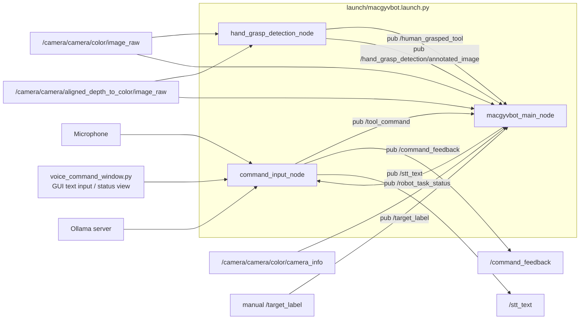

# MacGyvBot

MacGyvBot은 음성 명령 기반 공구 서랍 관리 로봇팔 어시스턴트를 위한 ROS 2 패키지입니다.

현재 저장소는 RealSense 카메라, YOLO 객체 인식, MoveItPy 기반 로봇팔 이동, OnRobot RG2 그리퍼 제어를 함께 다룹니다. 또한 사람이 로봇이 들고 있는 공구를 잡았는지 판단하는 hand-tool grasp detection 노드를 포함합니다.

## 패키지 구조

메인 pick 파이프라인은 ROS wiring과 기능별 책임을 분리해 구성합니다.

```text
macgyvbot/
├── nodes/
│   ├── macgyvbot_main_node.py           # ROS wiring, parameter, frame loop
│   ├── hand_grasp_detection_node.py     # hand grasp detection ROS wiring
│   └── command_input_node.py            # STT + GUI + 명령 해석 통합 노드
├── config/
│   └── config.py                        # topic, frame, safety offset, grasp mode
├── util/
│   ├── command_input/
│   │   ├── input_mapping/               # local parser + LLM fallback
│   │   └── stt/                         # microphone STT wrapper
│   ├── hand_grasp_detection/
│   │   └── hand_grasp/                  # hand/tool grasp 판정 유틸
│   └── macgyvbot_main/
│       ├── grasp_mechanism/             # center/VLM grasp point 선택
│       ├── model_control/               # MoveIt, pose, gripper, force, safe zone
│       ├── perception/                  # YOLO, depth projection
│       └── task_pipeline/               # pick, handoff, return 시퀀스
│           ├── pick_sequence.py         # 공구 pick 및 사용자 전달 흐름
│           └── return_sequence.py       # 사용자 반납 수신 및 Home 배치 흐름
├── ui/
│   └── voice_command_window.py          # PyQt command input window
```

기존 executable 이름은 `macgyvbot`으로 유지되며, entrypoint는 `nodes/macgyvbot_main_node.py`를 직접 사용합니다.

## Pipeline Structure

현재 launch 기준 실행 구조와 ROS topic pub/sub 관계는 아래와 같습니다.



각 노드 내부에서 어떤 파일이 어떤 역할을 맡는지도 함께 보면 아래와 같습니다.

```mermaid
flowchart TD
    subgraph command["command_input_node"]
        cmdnode["nodes/command_input_node.py\nGUI + STT + topic wiring"]
        ui["ui/voice_command_window.py\nPyQt GUI"]
        sttmod["util/command_input/stt/speech_to_text.py\nmicrophone STT wrapper"]
        parser["util/command_input/input_mapping/command_llm_parser.py\nlocal parser + LLM fallback"]
        hard["util/command_input/input_mapping/command_hard_parser.py\nalias / fuzzy command parsing"]
        ui --> cmdnode
        sttmod --> cmdnode
        parser --> cmdnode
        hard --> parser
    end

    subgraph handgrasp["hand_grasp_detection_node"]
        hgNode["nodes/hand_grasp_detection_node.py\ncamera subscriptions + result publishing"]
        handDet["hand_grasp/hand_detector.py\nMediaPipe hand landmarks"]
        toolDet["hand_grasp/tool_detector.py\nYOLO tool ROI detection"]
        calc["hand_grasp/calculations.py\ngeometry / depth / hand selection helpers"]
        graspDet["hand_grasp/grasp_detector.py\nhand-tool grasp state scoring"]
        viz["hand_grasp/visualization.py\noverlay rendering"]
        handDet --> hgNode
        toolDet --> hgNode
        calc --> hgNode
        calc --> handDet
        calc --> graspDet
        calc --> viz
        graspDet --> hgNode
        viz --> hgNode
    end

    subgraph mainbot["macgyvbot_main_node"]
        mainNode["nodes/macgyvbot_main_node.py\nmain ROS wiring + frame loop + command handling"]
        yolo["util/macgyvbot_main/perception/yolo_detector.py\nobject detection"]
        graspSel["util/macgyvbot_main/grasp_mechanism/grasp_point_selector.py\ncenter/VLM grasp-point routing"]
        vlm["util/macgyvbot_main/grasp_mechanism/grasp_by_vlm.py\nVLM grasp pixel inference"]
        depthProj["util/macgyvbot_main/perception/depth_projection.py\npixel+depth to base pose"]
        motion["util/macgyvbot_main/model_control/moveit_controller.py\nMoveIt planning / execution"]
        pose["util/macgyvbot_main/model_control/robot_pose.py\npose/orientation helpers"]
        safe["util/macgyvbot_main/model_control/robot_safezone.py\nworkspace clamp"]
        grip["util/macgyvbot_main/model_control/onrobot_gripper.py\nRG gripper control"]
        pipeline["util/macgyvbot_main/task_pipeline/\npick / handoff / return sequence"]
        yolo --> mainNode
        graspSel --> mainNode
        depthProj --> mainNode
        motion --> mainNode
        grip --> mainNode
        pipeline --> mainNode
        vlm --> graspSel
        pose --> depthProj
        pose --> motion
        pose --> pipeline
        safe --> motion
        safe --> pipeline
    end
```



토픽 기준으로 요약하면:

- `command_input_node`는 사용자 입력을 받아 `/tool_command`, `/command_feedback`, `/stt_text`를 발행하고 `/robot_task_status`를 구독합니다.
- `hand_grasp_detection_node`는 카메라 입력을 받아 `/human_grasped_tool`, `/hand_grasp_detection/annotated_image`를 발행합니다.
- `macgyvbot_main_node`는 카메라/명령/hand grasp 결과를 구독해서 pick pipeline을 실행하고 `/robot_task_status`를 발행합니다.

## 주요 기능

- RealSense color/depth 이미지 구독
- YOLO 기반 공구 및 대상 객체 인식
- hand landmark와 tool ROI 기반 잡기 상태 판단
- depth 기반 손-공구 접촉 신호 기본 사용
- MoveItPy 기반 Doosan M0609 경로 계획 및 실행
- OnRobot RG2 그리퍼 open/close 제어
- 안전 작업 영역 클램프 기반 pick sequence 제한

## 실행 환경

- OS: `Ubuntu 22.04`
- ROS 2: `Humble`
- Python: `3.10`
- 로봇팔: `Doosan-Robotics-M0609`
- 그리퍼: `OnRobot RG2`
- 카메라: `Intel RealSense Depth Camera D435I`

## 설치 및 빌드

[Doosan ROS 2 Manual(Humble)](https://doosanrobotics.github.io/doosan-robotics-ros-manual/humble/installation.html)

MacGyvBot은 두산로보틱스 ROS 2 패키지와 함께 사용합니다. `macgyvbot` 패키지는 두산로보틱스 워크스페이스의 `doosan-robot2` 아래에 clone한 뒤, `ros2_ws/src` 기준에서 빌드합니다.

```bash
cd ~/ros2_ws/src/doosan-robot2/
git clone https://github.com/MacGyvBot/macgyvbot.git
```

Python 패키지 설치:

```bash
pip install -r requirements.txt
```

전체 워크스페이스 빌드:

```bash
cd ~/ros2_ws
colcon build
```

`macgyvbot` 패키지만 빌드:

```bash
cd ~/ros2_ws
colcon build --packages-select macgyvbot
```

빌드 후 source:

```bash
source /opt/ros/humble/setup.bash
source ~/ros2_ws/install/setup.bash
```

## 전체 파이프라인 실행

각 터미널은 새로 열 때마다 ROS 2, `ros2_ws`, Doosan MoveIt 환경을 source한 뒤 실행합니다.

### Terminal 1: Doosan M0609 + MoveIt 실행

```bash
source /opt/ros/humble/setup.bash
source ~/ros2_ws/install/setup.bash

ros2 launch dsr_bringup2 dsr_bringup2_moveit.launch.py \
  mode:=real \
  model:=m0609 \
  host:=192.168.1.100
```

### Terminal 2: RealSense 카메라 실행

기본 실행은 YOLO bounding box 중심점을 grasp point로 사용합니다.

```bash
source /opt/ros/humble/setup.bash
source ~/ros2_ws/install/setup.bash

ros2 launch realsense2_camera rs_align_depth_launch.py \
  depth_module.depth_profile:=640x480x30 \
  rgb_camera.color_profile:=640x480x30 \
  initial_reset:=true \
  align_depth.enable:=true
```

### Terminal 3: MacGyvBot 메인 파이프라인 실행

기본 실행은 `center` grasp point mode를 사용합니다.

```bash
source /opt/ros/humble/setup.bash
source ~/ros2_ws/install/setup.bash

ros2 launch macgyvbot macgyvbot.launch.py
```

명시적으로 중심점 모드를 사용할 경우:

```bash
source /opt/ros/humble/setup.bash
source ~/ros2_ws/install/setup.bash

ros2 launch macgyvbot macgyvbot.launch.py grasp_point_mode:=center
```

VLM 기반 grasp point selection을 사용할 경우:

```bash
source /opt/ros/humble/setup.bash
source ~/ros2_ws/install/setup.bash

ros2 launch macgyvbot macgyvbot.launch.py grasp_point_mode:=vlm
```

VLM 모드는 YOLO가 검출한 객체 crop에서 grid 기반 grasp region을 선택한 뒤 depth로 grasp pixel을 보정합니다. VLM 추론 또는 depth 보정이 실패하면 기존 중심점 방식으로 fallback합니다.

`macgyvbot.launch.py`는 로봇 메인 노드, hand grasp detection, STT/GUI/명령 해석 통합 노드를 함께 실행합니다. 최종 데모용 기본 launch는 TTS까지 함께 켜지도록 설정되어 있으므로 일반 실행은 아래 명령 하나면 됩니다.

```bash
ros2 launch macgyvbot macgyvbot.launch.py
```

TTS 음성 출력에는 TTS 엔진이 필요합니다. 기본 설정은 `edge-tts`가 설치되어 있으면 더 자연스러운 온라인 음성을 먼저 사용하고, 없으면 `espeak-ng`를 사용합니다.

```bash
python3 -m pip install edge-tts
sudo apt install ffmpeg
sudo apt install espeak-ng
```

TTS를 임시로 끄고 싶을 때만 launch argument를 넘깁니다.

```bash
ros2 launch macgyvbot macgyvbot.launch.py use_tts:=false
```

TTS 엔진이 없거나 실행에 실패해도 경고만 남기고 GUI와 로봇 명령 흐름은 계속 동작합니다.

### Terminal 4: Ollama 서버 실행

LLM fallback을 사용하려면 Ollama 서버와 모델이 필요합니다. 이미 서버가 실행 중이면 이 터미널은 생략할 수 있습니다.

최초 설치:

```bash
curl -fsSL https://ollama.com/install.sh | sh
```

```bash
ollama pull gemma3:1b
ollama serve
```

### Terminal 5: 음성 명령 통합 노드 실행

로봇/카메라 없이 GUI와 명령 해석만 확인할 때는 통합 노드를 단독 실행합니다. 단독 실행 기본값은 GUI 입력 테스트에 맞춰 `enable_microphone=false`, `use_llm_fallback=true`, `model=gemma3:1b`, `parser_mode=llm_primary`, `enable_tts=true`입니다. 즉 옵션을 따로 주지 않아도 LLM을 먼저 사용하고, LLM이 확정하지 못할 때만 local parser가 최후 보조로 동작하며 GUI와 TTS가 함께 켜집니다.

```bash
source /opt/ros/humble/setup.bash
source ~/ros2_ws/install/setup.bash

ros2 run macgyvbot command_input_node
```

TTS를 임시로 끄고 싶을 때만 명시적으로 파라미터를 줍니다.

```bash
ros2 run macgyvbot command_input_node --ros-args \
  -p use_gui:=true \
  -p enable_microphone:=false \
  -p use_llm_fallback:=true \
  -p model:=gemma3:1b \
  -p enable_tts:=false
```

MacGyvBot 답변과 확인 질문, 주요 작업 상태를 자연스러운 edge-tts 음성으로 듣고 싶다면 실행컴에 edge-tts와 재생 도구를 설치합니다. 설치되어 있지 않으면 `espeak-ng`를 fallback으로 사용합니다.

```bash
python3 -m pip install edge-tts
sudo apt install ffmpeg
sudo apt install espeak-ng

ros2 run macgyvbot command_input_node --ros-args \
  -p use_gui:=true \
  -p enable_microphone:=false \
  -p use_llm_fallback:=true \
  -p model:=gemma3:1b
```

edge-tts 음성을 명시적으로 사용할 경우:

```bash
ros2 run macgyvbot command_input_node --ros-args \
  -p use_gui:=true \
  -p tts_engine:=edge \
  -p tts_voice:=ko-KR-SunHiNeural \
  -p tts_edge_rate:="+10%" \
  -p tts_pitch:="+8Hz"
```

전체 launch에서 edge-tts 음성을 명시적으로 사용할 경우:

```bash
ros2 launch macgyvbot macgyvbot.launch.py \
  tts_engine:=edge \
  tts_voice:=ko-KR-SunHiNeural \
  tts_edge_rate:="+10%" \
  tts_pitch:="+8Hz"
```

전체 launch에서 사용할 경우:

```bash
ros2 launch macgyvbot macgyvbot.launch.py
```

TTS 관련 파라미터:

- `enable_tts`: TTS 사용 여부, 기본값 `true`
- `tts_engine`: 사용할 엔진, 기본값 `auto` (`edge-tts` 우선, 실패 시 `espeak-ng` fallback)
- `tts_voice`: TTS voice, 기본값 `ko-KR-SunHiNeural`
- `tts_rate`: `espeak-ng` 읽기 속도, 기본값 `165`
- `tts_edge_rate`: `edge-tts` 읽기 속도, 기본값 `+25%`
- `tts_pitch`: `edge-tts` pitch, 기본값 `+35Hz`
- `tts_timeout_sec`: 한 문장 TTS 생성/재생 제한 시간, 기본값 `20.0`

마이크 STT까지 단독으로 확인하려면 `enable_microphone:=true`로 실행합니다.

```bash
ros2 run macgyvbot command_input_node --ros-args -p enable_microphone:=true
```

통합 노드는 GUI 채팅 입력과 선택적 마이크 STT를 처리하며, `/tool_command`, `/command_feedback`을 발행합니다. 로봇 실행 상태는 `/robot_task_status`로 GUI에 돌아옵니다. 명령 해석기는 최근 입력과 최근 성공 작업을 메모리에 짧게 보관해서 “아까 가져온 거 정리해”, “지금 뭐 하는 중이야?” 같은 문장을 처리합니다. 이 context는 파일로 저장하지 않으며 노드 재시작 시 초기화됩니다.

`/robot_task_status`는 JSON 문자열로 받으며, GUI에서는 내부 상태명을 그대로 보여주지 않고 MacGyvBot 말풍선과 좌측 상태 패널로 변환해 표시합니다. 예를 들어 `searching`은 “드라이버를 찾는 중입니다.”, `waiting_handoff`는 “손으로 공구를 잡아주세요.”처럼 표시됩니다. 같은 상태가 연속으로 반복되면 채팅과 TTS를 중복 출력하지 않습니다.

TTS는 MacGyvBot이 사용자에게 꼭 알려야 하는 문장만 읽습니다. 확인 질문, 실패/오류, `waiting_handoff`, `done`, `paused`, `resumed` 같은 상태는 음성으로 안내하고, `searching`처럼 자주 반복되는 진행 상태나 confidence/method 같은 디버그 정보는 읽지 않습니다.

상태 표시만 수동으로 확인하려면 GUI를 켠 뒤 별도 터미널에서 아래처럼 publish할 수 있습니다.

```bash
ros2 topic pub --once /robot_task_status std_msgs/msg/String \
  "{data: '{\"status\":\"waiting_handoff\",\"tool_name\":\"screwdriver\"}'}"

ros2 topic pub --once /robot_task_status std_msgs/msg/String \
  "{data: '{\"status\":\"failed\",\"tool_name\":\"screwdriver\",\"reason\":\"robot_grasp_failed\"}'}"
```

GUI 실행에 PyQt5가 필요합니다.

```bash
sudo apt install python3-pyqt5
```

예:

```text
You > 드라이버 가져다줘
You > 그 조이는 거 가져와
You > 망치 줘
You > 아까 가져온 거 정리해
You > 지금 뭐 하는 중이야?
```

흐름:

```text
command_input_node (GUI + STT input)
  -> /stt_text
  -> command parser (LLM primary -> local parser fallback)
  -> /tool_command
  -> macgyvbot
  -> /robot_task_status
```

명령 해석 모드는 두 가지입니다.

- `parser_mode:=llm_primary`: 기본값. LLM으로 먼저 의도와 context를 해석하고, LLM이 확정하지 못한 경우에만 local parser가 보조합니다.
- `parser_mode:=hybrid`: 빠른 local parser를 먼저 쓰고 실패하면 LLM fallback을 사용합니다. 디버깅이나 Ollama가 불안정한 환경에서만 사용합니다.

최종 데모 전 LLM 중심 해석을 확인하려면 아래처럼 실행합니다.

```bash
ros2 run macgyvbot command_input_node --ros-args \
  -p parser_mode:=llm_primary
```

전체 로봇 launch에서 마이크 STT 없이 키보드 입력만 테스트하려면 `use_stt:=false`로 실행합니다.

```bash
ros2 launch macgyvbot macgyvbot.launch.py use_stt:=false
```

반납/정리 명령은 `/tool_command`에 JSON 문자열로 발행됩니다. `action`이
`return`이면 메인 노드는 hand grasp detection 결과로 사용자가 들고 있는 공구를
확인하기 전에 Home 기준 전방 20cm 위치로 이동합니다. 해당 위치에서 반납 공구를
감지한 뒤 그리퍼를 닫아 공구를 받고, Home의 z=0.30m 위치로 이동해 Z를 낮추다가
Z 반대방향 힘이 임계값 이상 감지되면 하강을 멈추고 공구를 놓은 뒤 Home으로
복귀합니다. Pick 동작은 Home
근처에서 공구를 인식해 grasp한 뒤, Home 기준 전방 20cm 사용자 전달 위치로
이동하고 hand grasp detection 결과로 사용자 손 grasp를 확인합니다. 전달 후에는
그리퍼를 열고 Home으로 복귀합니다.

```bash
ros2 topic pub --once /tool_command std_msgs/msg/String \
  "{data: '{\"tool_name\":\"screwdriver\",\"action\":\"return\",\"raw_text\":\"드라이버 반납해\",\"match_method\":\"manual\",\"match_score\":1.0,\"confidence\":1.0,\"status\":\"accepted\"}'}"
```

반납 처리 상태는 `/robot_task_status`에 JSON 문자열로 발행됩니다.
반납 Home 하강 중 Z 반력은 `force_torque_topic` launch parameter의
`geometry_msgs/msg/WrenchStamped` 입력을 사용하며 기본값은
`/force_torque_sensor_broadcaster/wrench`입니다.

Pick/return 중 로봇 그리퍼가 공구를 실제로 잡았는지는 OnRobot RG 상태의
`grip detected` 신호와 그리퍼 폭으로 확인합니다. 그리퍼가 완전히 닫힌 폭이면
`grip detected`가 켜져도 성공으로 처리하지 않습니다. 그리퍼 동작이 끝난 뒤
조건이 연속으로 유지될 때만 성공으로 처리합니다. 성공하면
`status=grasp_success`가 발행되고, 신호가 확인되지 않거나 완전 닫힘 상태이면
`status=failed`, `reason=robot_grasp_failed` 또는 `reason=return_grasp_failed`가
발행됩니다. grasp 실패 시에는 최대 `GRASP_RETRY_LIMIT`회까지 gripper open/close
재시도를 수행합니다.

실행컴에서 브랜치를 바꾼 뒤에는 반드시 다시 빌드하고 새 터미널에서 source 해야 합니다.

```bash
git switch feature/#2-voice-command
git pull

cd ~/ros2_ws
colcon build --packages-select macgyvbot
source install/setup.bash
```

실행 중인 파라미터가 맞는지 확인하려면 아래 명령을 사용합니다.

```bash
ros2 param get /command_input_node use_llm_fallback
ros2 param get /command_input_node model
ros2 param get /command_input_node parser_mode
```

기대값은 `True`, `gemma3:1b`, `llm_primary`입니다.

## 수동 대상 공구 요청

음성 명령 파이프라인을 거치지 않고 기존 방식으로 대상 공구를 직접 요청할 수도 있습니다.

```bash
ros2 topic pub --once /target_label std_msgs/msg/String "{data: screwdriver}"
```

사용 가능한 공구 label은 학습한 YOLO 모델의 class 이름과 같아야 합니다. 현재 명령 파서는 수업 데모 범위에 맞춰 `hammer`, `pliers`, `screwdriver`, `tape_measure` 네 가지 공구를 기준으로 합니다.

## 음성 명령 입력만 테스트

전체 로봇 launch에서 마이크 STT 없이 키보드 입력만 확인할 때는 `macgyvbot.launch.py`에서 STT를 끄고 실행합니다.

```bash
source /opt/ros/humble/setup.bash
source ~/ros2_ws/install/setup.bash

ros2 launch macgyvbot macgyvbot.launch.py use_stt:=false
```

별도 UI 노드 실행은 필요하지 않습니다.

## 잡기 인식 노드 실행

`macgyvbot.launch.py`는 hand grasp detection 노드를 함께 실행합니다.

```bash
source /opt/ros/humble/setup.bash
source ~/ros2_ws/install/setup.bash

ros2 launch macgyvbot macgyvbot.launch.py
```

기본 구독 토픽:

- `/camera/camera/color/image_raw`
- `/camera/camera/aligned_depth_to_color/image_raw`

기본 발행 토픽:

- `/human_grasped_tool`: `std_msgs/msg/String` JSON 결과
- `/hand_grasp_detection/annotated_image`: annotation 이미지
- `/hand_grasp_detection/tool_mask_lock`: robot grasp 이후 mask lock 성공/실패 JSON 결과

커스텀 YOLO 모델을 사용할 경우 launch 파라미터 `yolo_model`에 모델 경로를 지정합니다. 모델 파일은 저장소에 커밋하지 않습니다.

예:

```bash
ros2 launch macgyvbot macgyvbot.launch.py yolo_model:=/path/to/yolov11_best.pt
```

전달 파이프라인에서는 hand grasp detection 노드가 `/robot_task_status`의
`accepted/searching/picking/grasping` 구간에서만 최신 YOLO tool ROI와 선택적
SAM mask를 갱신합니다. 이 구간은 공구 후보 선택과 VLM 호출 전후부터 robot
grasp 직전까지입니다. 로봇이 gripper close 후 공구 grasp에 성공하면 main
노드가 `/robot_task_status`에 `status=grasp_success`를 발행합니다. hand grasp
detection 노드는 이 이벤트에서 직전 SAM mask 또는 bbox ROI를 lock하고
`/hand_grasp_detection/tool_mask_lock`에 성공/실패를 발행합니다. main pick
sequence는 이 lock 응답을 확인한 뒤에만 lift와 handoff 이동을 시작합니다.

handoff pose에서는 사용자 손이 locked ROI/mask 근처에 있는지, 손 landmark의
depth가 공구 ROI depth와 가까운지, `.pkl` ML classifier가 `grasp`로 판정하는지
함께 확인합니다. 기본 설정에서는 ML raw/stable 상태가 모두 `grasp`이고,
ML confidence가 `0.85` 이상이며 depth 조건을 통과해야 `/human_grasped_tool`의
`human_grasped_tool=true`가 발행됩니다.

ML 모델은 Git에 포함하지 않습니다. 기본 경로는 `weights/hand_grasp_model.pkl`
이며, 다른 경로를 쓸 때는 launch 파라미터로 넘깁니다.

```bash
ros2 launch macgyvbot macgyvbot.launch.py \
  yolo_model:=/path/to/merge.pt \
  grasp_model:=/path/to/hand_grasp_model.pkl
```

SAM mask lock은 선택 기능입니다. 기본값은 bbox lock fallback이며, MobileSAM
checkpoint가 준비된 환경에서는 다음처럼 켤 수 있습니다. SAM은 lock 전 최신
mask를 주기적으로 갱신하므로, robot grasp 직후 현재 프레임에서 공구가 일부
가려져도 직전 mask를 lock 기준으로 사용할 수 있습니다.

MobileSAM checkpoint는 다음 명령으로 준비합니다. 모델 파일은 `weights/`에
저장되지만 Git에는 포함하지 않습니다.

```bash
python weights/download_sam_weights.py --model mobile_sam
```

원본 SAM ViT-B checkpoint가 필요하면 다음 명령을 사용합니다.

```bash
python weights/download_sam_weights.py --model sam_vit_b
```

```bash
ros2 launch macgyvbot macgyvbot.launch.py \
  grasp_model:=/path/to/hand_grasp_model.pkl \
  sam_enabled:=true \
  sam_checkpoint:=/path/to/mobile_sam.pt
```

## 테스트

```bash
colcon test --packages-select macgyvbot
colcon test-result --verbose
```

## 기여

브랜치, 커밋, PR, 이슈, 안전 규칙은 [CONTRIBUTING.md](./CONTRIBUTING.md)를 따릅니다.
