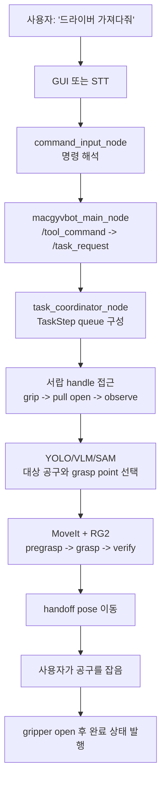
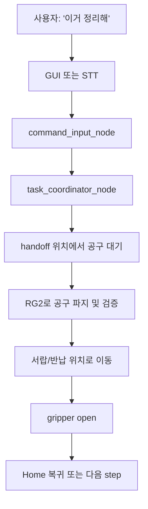
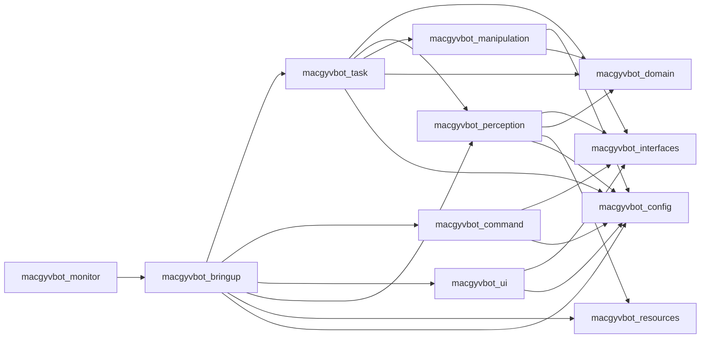
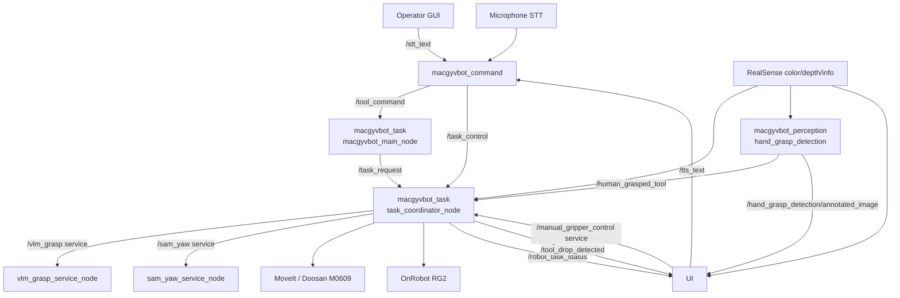

# MacGyvBot

MacGyvBot은 음성 또는 operator GUI 명령으로 공구를 가져오고 반납하는
ROS 2 기반 로봇팔 어시스턴트입니다. Intel RealSense 카메라, YOLO/VLM
perception, Doosan M0609 + MoveItPy, OnRobot RG2 그리퍼, 사용자 hand-tool
grasp detection, PyQt GUI를 하나의 데모 파이프라인으로 묶습니다.

이 저장소 루트는 `colcon` workspace입니다. 실제 ROS 2 runtime 패키지는
`src/` 아래에 있습니다.

## 먼저 읽기

- 처음 실행하는 사용자는 이 README의 `준비물`, `설치`, `실행 순서`,
  `명령 예시`, `문제 해결`을 순서대로 보면 됩니다.
- 패키지별 세부 책임과 내부 파일 역할은 [EXPLAIN.md](./EXPLAIN.md)를 봅니다.
- ROS topic/service 계약은 [docs/architecture/topics.md](./docs/architecture/topics.md)를 봅니다.
- 작업자와 에이전트 공통 지침은 [AGENTS.md](./AGENTS.md)를 봅니다.

## 준비물

### 하드웨어

- Doosan Robotics M0609
- OnRobot RG2 gripper
- Intel RealSense D435I 또는 호환 RealSense 카메라
- RealSense를 볼 수 있는 작업대와 충분한 로봇 동작 공간
- 마이크와 스피커 또는 헤드셋

### 소프트웨어

- Ubuntu 22.04
- ROS 2 Humble
- Python 3.10
- Doosan ROS 2 Humble stack
- RealSense ROS 2 driver
- MoveIt/MoveItPy가 포함된 ROS 환경
- GPU 환경은 VLM/SAM 모델 실행에 권장됩니다.

Doosan, RealSense, MoveIt 설치는 이 저장소가 제공하지 않습니다. MacGyvBot을
실행하기 전에 각 장비의 기본 ROS launch가 독립적으로 동작하는지 먼저
확인하세요.

## 설치

워크스페이스를 clone합니다.

```bash
cd ~
git clone https://github.com/MacGyvBot/macgyvbot.git
cd ~/macgyvbot
```

Python/runtime 의존성을 설치합니다.

```bash
sudo apt update
sudo apt install -y portaudio19-dev ffmpeg python3-pyqt5
python3 -m pip install -r requirements.txt
```

`portaudio19-dev`는 `PyAudio` 빌드에 필요합니다. `ffmpeg`는 TTS 오디오 재생에
필요합니다. GUI는 `PyQt5`를 사용하며, apt 대신 pip 환경을 쓰는 경우
`python3 -m pip install PyQt5`로 설치할 수 있습니다.

TTS fallback까지 준비하려면 `espeak-ng`도 설치합니다.

```bash
sudo apt install -y espeak-ng
```

LLM 기반 자연어 command parser를 쓰려면 Ollama와 기본 모델을 준비합니다.
Ollama가 없거나 응답하지 않으면 규칙 기반 parser fallback이 동작하지만,
자연어 표현 coverage가 줄어들 수 있습니다.

```bash
curl -fsSL https://ollama.com/install.sh | sh
ollama pull gemma3:1b
ollama serve
```

`ollama serve`는 MacGyvBot launch 전에 별도 터미널에서 켜 둡니다.

## 모델과 리소스

모델 weight와 calibration 파일은 Git에 포함하지 않습니다. 기본 위치는
`macgyvbot_resources` 패키지입니다.

```text
src/macgyvbot_resources/calibration/T_gripper2camera.npy
src/macgyvbot_resources/weights/best.pt
src/macgyvbot_resources/weights/hand_grasp_model.pkl
src/macgyvbot_resources/weights/mobile_sam.pt
src/macgyvbot_resources/weights/vlm/
```

빌드 후 runtime은 설치된 package share에서 asset을 찾습니다.

```text
install/macgyvbot_resources/share/macgyvbot_resources/
```

VLM/SAM weight 다운로드 helper는 `src/macgyvbot_resources/weights/` 아래에
있습니다. 리소스 패키지의 자세한 설명은
[src/macgyvbot_resources/README.md](./src/macgyvbot_resources/README.md)를
확인하세요.

YOLO와 RealSense가 직접 연결되는지 먼저 확인하려면 아래 smoke test를 사용할 수
있습니다.

```bash
python src/macgyvbot_resources/weights/test_yolo_realsense.py
```

이미 ROS RealSense launch가 카메라를 사용 중이면 이 직접 테스트는 실패할 수
있습니다. 그 경우 ROS camera launch를 먼저 종료하세요.

## 빌드

각 새 터미널에서 ROS와 workspace를 source합니다.

```bash
source /opt/ros/humble/setup.bash
cd ~/macgyvbot
colcon build
source install/setup.bash
```

브랜치를 바꾸거나 패키지를 다시 빌드한 뒤에는 새 터미널에서
`source install/setup.bash`를 다시 실행합니다.

## 실행 순서

MacGyvBot은 장비 stack과 application stack을 분리해서 실행합니다. 아래 순서를
기본으로 사용하세요.

### 1. 로봇과 MoveIt 실행

```bash
source /opt/ros/humble/setup.bash
source ~/macgyvbot/install/setup.bash

ros2 launch dsr_bringup2 dsr_bringup2_moveit.launch.py \
  mode:=real \
  model:=m0609 \
  host:=192.168.1.100
```

`host`는 실제 Doosan controller IP에 맞게 바꿉니다.

### 2. RealSense 실행

```bash
source /opt/ros/humble/setup.bash
source ~/macgyvbot/install/setup.bash

ros2 launch realsense2_camera rs_align_depth_launch.py \
  depth_module.depth_profile:=640x480x30 \
  rgb_camera.color_profile:=640x480x30 \
  initial_reset:=true \
  align_depth.enable:=true
```

MacGyvBot은 기본적으로 아래 camera topic을 사용합니다.

```text
/camera/camera/color/image_raw
/camera/camera/aligned_depth_to_color/image_raw
/camera/camera/color/camera_info
```

### 3. MacGyvBot 실행

```bash
source /opt/ros/humble/setup.bash
source ~/macgyvbot/install/setup.bash

ros2 launch macgyvbot_bringup macgyvbot.launch.py
```

기본 launch는 다음 node를 함께 실행합니다.

- `macgyvbot_task/macgyvbot`: command router
- `macgyvbot_task/task_coordinator_node`: pick/return workflow와 MoveIt/RG2 실행
- `macgyvbot_perception/hand_grasp_detection`: 사용자 hand-tool grasp 감지
- `macgyvbot_perception/vlm_grasp_service_node`: VLM grasp point service
- `macgyvbot_perception/sam_yaw_service_node`: SAM yaw/width service
- `macgyvbot_command/command_input_node`: STT, command parsing, TTS
- `macgyvbot_ui/operator_ui_node`: PyQt operator GUI

Discord 알림과 launch 로그 저장이 필요하면 monitor wrapper를 사용합니다.

```bash
export DISCORD_WEBHOOK="https://discord.com/api/webhooks/xxxx/yyyy"
ros2 run macgyvbot_monitor launch_monitor -- \
  ros2 launch macgyvbot_bringup macgyvbot.launch.py
```

`DISCORD_WEBHOOK`이 없으면 Discord 전송만 생략됩니다. 로그는
`~/macgyvbot_monitor/macgyvbot_log/`에 저장됩니다.

## 자주 바꾸는 실행 옵션

마이크 STT 없이 GUI 텍스트 입력만 쓰고 싶다면:

```bash
ros2 launch macgyvbot_bringup macgyvbot.launch.py use_stt:=false
```

TTS를 끄거나 음성을 바꾸려면:

```bash
ros2 launch macgyvbot_bringup macgyvbot.launch.py use_tts:=false

ros2 launch macgyvbot_bringup macgyvbot.launch.py \
  use_tts:=true \
  tts_engine:=edge \
  tts_voice:=ko-KR-InJoonNeural
```

마이크가 너무 민감하거나 명령을 너무 늦게 확정하면 STT threshold를 조정합니다.

```bash
ros2 launch macgyvbot_bringup macgyvbot.launch.py \
  stt_pause_threshold:=0.45 \
  stt_phrase_threshold:=0.15 \
  stt_non_speaking_duration:=0.25 \
  stt_phrase_time_limit:=3.0
```

grasp point 선택 방식을 바꾸려면 `grasp_point_mode`를 지정합니다.

```bash
ros2 launch macgyvbot_bringup macgyvbot.launch.py grasp_point_mode:=yolo
ros2 launch macgyvbot_bringup macgyvbot.launch.py grasp_point_mode:=center
ros2 launch macgyvbot_bringup macgyvbot.launch.py grasp_point_mode:=vlm
ros2 launch macgyvbot_bringup macgyvbot.launch.py grasp_point_mode:=vlm_only_smol
ros2 launch macgyvbot_bringup macgyvbot.launch.py grasp_point_mode:=vlm_only_qwen3b
ros2 launch macgyvbot_bringup macgyvbot.launch.py grasp_point_mode:=vlm_only_qwen7b
ros2 launch macgyvbot_bringup macgyvbot.launch.py grasp_point_mode:=api
```

현재 기본값과 mode 상수는
`src/macgyvbot_config/macgyvbot_config/vlm.py`에서 관리합니다. Gemini API 기반
`api` mode는 `GEMINI_API_KEY` 또는 launch argument로 전달한 env 파일이
필요합니다.

장비 bringup 또는 디버깅 중 collision scene을 일시적으로 끌 수 있습니다. 실제
로봇 동작에서는 안전 검증 없이 비활성화하지 마세요.

```bash
ros2 launch macgyvbot_bringup macgyvbot.launch.py \
  enable_drawer_collision_scene:=false \
  enable_gripper_self_collision_acm:=false
```

## 명령 예시

GUI 입력창이나 마이크로 아래와 같은 한국어 명령을 사용할 수 있습니다.

```text
드라이버 가져다줘
플라이어 가져와
망치 줘
이거 정리해
드라이버 정리해
멈춰
재개
홈위치로 가
복귀해
종료
```

주요 의미는 다음과 같습니다.

| 사용자 의도 | 내부 action | 설명 |
| --- | --- | --- |
| 공구 가져오기 | `bring` | 서랍을 열고 대상 공구를 찾아 집은 뒤 사용자에게 전달합니다. |
| 공구 반납하기 | `return` | 사용자에게서 공구를 넘겨받고 서랍 또는 지정 위치에 정리합니다. |
| 멈춤/일시정지 | `pause` 또는 `cancel` | 현재 task queue 또는 motion을 중단합니다. |
| 재개 | `resume` | 일시정지된 작업을 이어갑니다. |
| 홈 복귀 | `home` | 로봇이 대기 중일 때 Home joint pose로 이동하고 gripper를 엽니다. |
| 종료 | `exit` | 실행 중 작업을 끝내고 Home 복귀 후 GUI/command lifecycle을 종료합니다. |

GUI의 manual gripper control은 `/manual_gripper_control` service를 통해 RG2 width
명령을 보냅니다. task 실행 중이거나 gripper 상태가 안전하지 않으면
`task_coordinator_node`가 요청을 거부합니다.

## 사용자 관점 워크플로우

### 공구 가져오기



### 공구 반납하기



### 공구 drop recovery

gripper가 공구를 잡은 뒤 `/tool_drop_detected`에서 `event=tool_dropped`가
발행되면 task coordinator는 현재 MoveIt goal을 cancel하고 남은 queue를 비운 뒤
recovery mode로 들어갑니다. recovery는 새 알고리즘을 만들지 않고 기존 target
resolver, grasp verifier, drawer flow, home motion을 다시 orchestration합니다.
자세한 내용은 [docs/drop_recovery.md](./docs/drop_recovery.md)를 봅니다.

## 패키지 역할

```text
src/
├── macgyvbot_bringup/        # launch와 runtime wiring
├── macgyvbot_task/           # command routing, task queue, pick/return/recovery
├── macgyvbot_command/        # STT, TTS, command parser, command feedback
├── macgyvbot_ui/             # operator GUI와 ROS topic/service adapter
├── macgyvbot_perception/     # YOLO, VLM/SAM, depth projection, hand grasp detection
├── macgyvbot_manipulation/   # MoveIt, RG2, force sensing, safe workspace, handoff
├── macgyvbot_config/         # topic names, frame names, thresholds, runtime constants
├── macgyvbot_domain/         # ROS 없는 Python dataclass/domain model
├── macgyvbot_interfaces/     # msg/srv typed ROS contracts
├── macgyvbot_resources/      # calibration, URDF, model weight asset package
└── macgyvbot_monitor/        # launch log capture and Discord notification wrapper
```

패키지 의존 방향은 아래처럼 유지합니다.



규칙은 단순합니다. `bringup`은 launch에서 연결하고, `command`는 사용자 입력을
typed command로 바꾸며, `task`는 perception/manipulation을 조율합니다.
`perception`은 로봇을 직접 움직이지 않고, `manipulation`은 사용자 명령을
해석하지 않습니다. `ui`는 ROS topic/service를 통해서만 상태를 표시하고 의도를
보냅니다.

## Runtime 데이터 흐름



전체 topic/service 표는
[docs/architecture/topics.md](./docs/architecture/topics.md)에 있습니다.

## 주요 topic과 service

| 이름 | Type | 역할 |
| --- | --- | --- |
| `/stt_text` | `macgyvbot_interfaces/msg/CommandText` | GUI 또는 STT가 입력한 사용자 문장 |
| `/tool_command` | `macgyvbot_interfaces/msg/ToolCommand` | command parser가 해석한 bring/return/home 등 공구 명령 |
| `/task_request` | `macgyvbot_interfaces/msg/TaskRequest` | router가 task coordinator로 넘기는 실행 요청 |
| `/task_control` | `macgyvbot_interfaces/msg/RobotTaskControl` | pause/resume/cancel/exit 제어 |
| `/robot_task_status` | `macgyvbot_interfaces/msg/RobotTaskStatus` | GUI와 command가 보는 task 진행 상태 |
| `/human_grasped_tool` | `macgyvbot_interfaces/msg/HumanGraspResult` | 사람이 공구를 잡았는지에 대한 perception 결과 |
| `/tool_drop_detected` | `macgyvbot_interfaces/msg/ToolDropEvent` | gripper hold monitor의 drop/safety event |
| `/manual_gripper_control` | `macgyvbot_interfaces/srv/SetGripper` | GUI manual RG2 width 제어 |
| `/vlm_grasp` | `macgyvbot_interfaces/srv/VLMGrasp` | VLM 기반 grasp pixel/yaw 추론 |
| `/sam_yaw` | `macgyvbot_interfaces/srv/SAMYaw` | SAM/depth 기반 yaw와 grasp width 추정 |

## 안전과 동작 경계

- 실제 로봇 동작 전에는 주변 사람, 작업대, 서랍, 카메라 케이블, gripper 동작
  범위를 확인하세요.
- motion parameter, force threshold, safe workspace, gripper timing은 안전 관련
  값입니다. 문서 정리나 일반 refactor와 함께 바꾸지 않습니다.
- pose goal 이동은 `macgyvbot_manipulation.moveit_controller`에서 현재 joint
  state 기준 IK 후보를 고르고, 큰 joint delta가 남으면 planning을 중단합니다.
- drawer collision scene과 RG2 self-collision ACM은 기본적으로 켜져 있습니다.
- planning failure, depth 누락, detection 누락, unsupported frame, interrupted
  task는 task coordinator에서 명시적으로 처리해야 합니다.

## 문제 해결

### GUI가 열리지 않음

- `python3-pyqt5` 또는 pip `PyQt5`가 설치되어 있는지 확인합니다.
- SSH 환경이면 X11/Wayland forwarding 또는 로컬 디스플레이가 준비되어야 합니다.
- GUI 없이 command/task만 분리 실행하려면 launch argument로 UI와 command 구성을
  조정하는 별도 launch가 필요합니다. 기본 launch는 GUI 종료 시 전체 launch도
  종료하도록 구성되어 있습니다.

### 마이크 입력이 안 들어옴

- `portaudio19-dev`, `PyAudio`, `SpeechRecognition` 설치를 확인합니다.
- `use_stt:=false`로 GUI 텍스트 입력만 먼저 검증합니다.
- 명령이 늦게 확정되면 `stt_pause_threshold`와 `stt_phrase_time_limit`을 낮춥니다.

### TTS가 재생되지 않음

- `ffmpeg`의 `ffplay`가 설치되어 있는지 확인합니다.
- `edge-tts` 네트워크 호출이 실패하면 `espeak-ng` fallback 설치 여부를 확인합니다.
- 우선 robot 동작 검증이 목적이면 `use_tts:=false`로 끄고 진행할 수 있습니다.

### LLM parser가 느리거나 실패함

- 별도 터미널에서 `ollama serve`가 실행 중인지 확인합니다.
- `ollama pull gemma3:1b`로 기본 모델을 받아 두었는지 확인합니다.
- LLM이 실패해도 규칙 기반 parser가 동작하므로 대표 명령부터 확인합니다.

### RealSense image/depth가 안 들어옴

- `ros2 topic hz /camera/camera/color/image_raw`를 확인합니다.
- aligned depth topic인 `/camera/camera/aligned_depth_to_color/image_raw`가
  발행되는지 확인합니다.
- 카메라가 직접 테스트 스크립트나 다른 ROS launch에 이미 점유되어 있지 않은지
  확인합니다.

### YOLO 또는 hand grasp 모델을 찾지 못함

- weight 파일이 `src/macgyvbot_resources/weights/` 아래에 있는지 확인합니다.
- 파일을 추가한 뒤 `colcon build`와 `source install/setup.bash`를 다시 실행합니다.
- 기본 YOLO 파일명은 `macgyvbot_config.models.YOLO_MODEL_NAME`의 `best.pt`입니다.

### VLM/SAM 관련 오류가 남

- `grasp_point_mode:=yolo` 또는 `grasp_point_mode:=center`로 먼저 기본 pick 흐름을
  분리해서 확인합니다.
- `mobile_sam.pt`와 VLM weight가 리소스 패키지 아래에 있는지 확인합니다.
- GPU 메모리가 부족하면 더 작은 VLM mode 또는 YOLO/center mode를 사용합니다.

### MoveIt planning이 실패함

- Doosan bringup과 MoveIt launch가 먼저 정상 동작하는지 확인합니다.
- `/joint_states`와 planning scene service가 발행/응답하는지 확인합니다.
- drawer collision scene이 목표 pose와 겹치면 planner가 경로를 만들 수 없습니다.
  이 경우 drawer geometry 또는 motion key routing을 별도 이슈로 분리해 조정합니다.

### gripper 또는 drop recovery가 이상함

- RG2 통신과 width feedback이 정상인지 먼저 확인합니다.
- `/tool_drop_detected`와 `/robot_task_status`를 함께 echo해서 drop event와 UI 상태가
  맞는지 확인합니다.
- recovery 세부 흐름은 [docs/drop_recovery.md](./docs/drop_recovery.md)를 봅니다.

## 검증

빠른 문법 검사는 다음 명령을 사용합니다.

```bash
python3 -m compileall -q src
```

핵심 단위 테스트:

```bash
python3 -m pytest -q \
  src/macgyvbot_manipulation/test/test_handover_targeting.py \
  src/macgyvbot_manipulation/test/test_gripper_grasp.py \
  src/macgyvbot_perception/test/test_hand_grasp_ml_mask.py \
  src/macgyvbot_task/test
```

ROS 환경이 준비된 경우 workspace 테스트:

```bash
colcon test
colcon test-result --verbose
```

로봇, MoveIt, 카메라, 모델, 네트워크 의존 검증은 실제 장비 환경에서 낮은 속도와
충분한 작업 공간을 확보한 뒤 수행합니다.

## 문서 유지 규칙

- package 역할, launch 경로, setup/build/run 명령, topic/service 계약이 바뀌면
  이 README를 함께 업데이트합니다.
- topic/service publisher, subscriber, payload가 바뀌면
  [docs/architecture/topics.md](./docs/architecture/topics.md)를 함께 업데이트합니다.
- 내부 파일 책임이나 큰 workflow가 바뀌면 [EXPLAIN.md](./EXPLAIN.md)를 업데이트합니다.
- 긴 설계 노트와 실험 기록은 `docs/` 아래에 둡니다.

## 기여

브랜치, 커밋, PR, 이슈, 리뷰 규칙은 프로젝트의 GitHub 이슈와
[AGENTS.md](./AGENTS.md)를 기준으로 맞춥니다. 범위가 불명확하면 먼저 active
issue를 확인하고, 안전 파라미터나 motion behavior 변경은 별도 이슈로 분리합니다.
